<h2 align="center">Olá, sejam bem-vindos 👋</h2>

  Eu sou <b>Rodrigo Henrique</b>. Adoro trabalhar com dados e ajudar os outros.
  Meus interesses profissionais são <b>Análise de Dados</b> e <b>Engenharia de Dados</b>.
  <b>Estou sempre disponível</b> para ajudar e esclarecer qualquer dúvida que você tenha.

<h3 align="center">Minhas Habilidades 🚀</h3>

  
  
  
  
  
  

<h3 align="center">Sobre Mim 🤓</h3>

  ❤️ Apaixonado por Dados. 
  🌳 Graduado em Engenharia da Computação. 
  🌳 Graduado em Análise e Desenvolvimento de Sistemas. 
  🌳 Especialização em Ciência de Dados e Arquitetura de Software. 
  ⚡ Experiência como Analista de Dados. 
  ⚡ Experiência como Engenheiro de Dados. 

Sua contribuição será muito bem-vinda, valeu mesmo! 😉️

<h3 align="center">Contate-me 🤝</h3>

  
  

<h3 align="center">Métricas 📊</h3>

  
  

  

